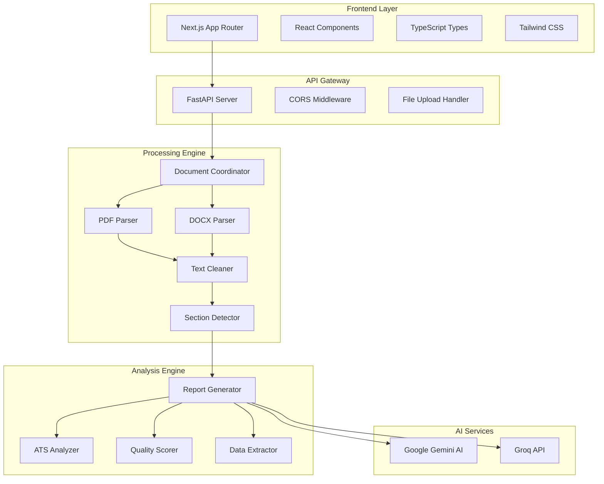
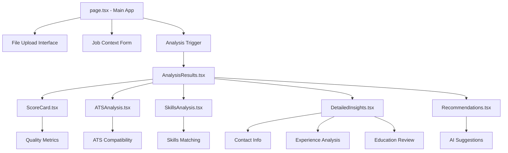
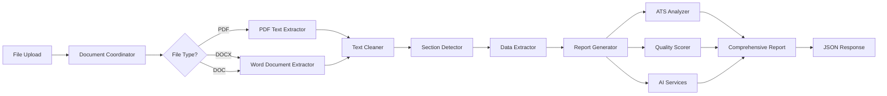
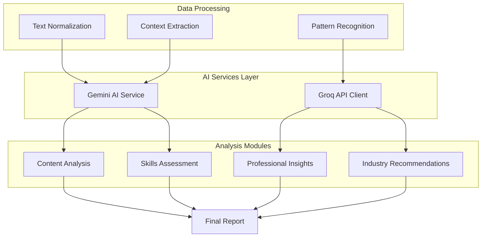

# 🚀 Resume Analyzer - AI-Powered Resume Analysis Platform

<div align="center">


**🎯 Comprehensive AI-Powered Resume Analysis with ATS Compatibility, Quality Scoring, and Professional Insights**

[🚀 Quick Start](#-quick-start) • [🏗️ Architecture](#%EF%B8%8F-architecture) • [📱 Frontend](#-frontend-architecture) • [🐍 Backend](#-backend-architecture) • [📊 Features](#-features)

</div>

---

## 🌟 Overview

**Resume Analyzer** is a comprehensive, full-stack application that leverages cutting-edge AI technology to provide detailed resume analysis, ATS compatibility scoring, and actionable professional insights. Built with modern web technologies and designed for both job seekers and hiring professionals.

### ✨ **Key Highlights**

- 🤖 **AI-Powered Analysis** - Google Gemini AI and Groq integration for intelligent insights
- 📊 **30+ Analysis Categories** - Comprehensive evaluation across multiple dimensions
- ⚡ **ATS Compatibility** - Ensure your resume passes Applicant Tracking Systems
- 🎯 **Quality Scoring** - 4-category scoring system (0-100 scale) with detailed feedback
- 🔍 **Skills Gap Analysis** - Identify missing skills and improvement opportunities
- 📱 **Modern UI/UX** - Responsive design with real-time analysis progress
- 🚀 **High Performance** - FastAPI backend with Next.js 15 + Turbopack frontend

---

## 📊 Features

### **🤖 AI-Powered Analysis**

- **Google Gemini AI Integration**: Advanced content analysis and insights
- **Groq API**: Fast language model inference for recommendations
- **Natural Language Processing**: Content quality assessment
- **Intelligent Recommendations**: Personalized improvement suggestions

### **📄 Document Processing**

- **Multi-format Support**: PDF, DOCX, DOC files
- **Advanced Text Extraction**: PyMuPDF for high-performance parsing
- **Section Detection**: Intelligent identification of resume sections
- **Metadata Extraction**: Contact info, education, experience, skills
- **Text Normalization**: Clean and structured text processing

### **📊 Comprehensive Scoring System**

```
🎯 Content Completeness (25%)     ⭐ Professional Presentation (25%)
🛠️ Skills Relevance (25%)        💼 Experience Quality (25%)
```

- **0-100 Scale**: Industry-standard scoring methodology
- **Detailed Breakdown**: Category-wise analysis and feedback
- **Benchmarking**: Comparison against industry standards
- **Progress Tracking**: Before/after analysis capabilities

### **🔍 ATS Compatibility Analysis**

- **Keyword Optimization**: Industry-specific keyword analysis
- **Format Compatibility**: ATS-friendly structure validation
- **Parsing Quality**: Machine-readability assessment
- **Compliance Scoring**: Industry standards alignment
- **Format Recommendations**: Suggestions for ATS optimization

### **💡 Professional Insights**

- **Industry Analysis**: Role-specific recommendations
- **Career Progression**: Experience timeline evaluation
- **Skills Matching**: Job requirement alignment
- **Competitive Analysis**: Market positioning insights
- **Gap Identification**: Missing skills and qualifications

### **🎯 Advanced Features**

- **Real-time Analysis**: Live progress updates during processing
- **Interactive Results**: Expandable sections with detailed insights
- **Job Context**: Enhanced analysis with job description input
- **Multi-dimensional Scoring**: Comprehensive evaluation metrics
- **Export Capabilities**: Downloadable analysis reports

---

## 🏗️ Architecture

### **System Architecture Overview**

The Resume Analyzer follows a modern full-stack architecture with clear separation between frontend, backend, and AI services:



### **Technology Stack**

| Layer | Technology | Purpose |
|-------|------------|----------|
| **Frontend** | Next.js 15.5.2 + React 19 | Modern web application framework |
| **Styling** | Tailwind CSS 4 | Utility-first CSS framework |
| **Language** | TypeScript 5 | Type-safe JavaScript |
| **Build Tool** | Turbopack | Ultra-fast bundler and dev server |
| **Backend** | FastAPI | High-performance async Python API |
| **AI Integration** | Google Gemini AI + Groq | Advanced language models |
| **Document Processing** | PyMuPDF + python-docx | PDF and DOCX parsing |
| **HTTP Client** | Native Fetch API | Frontend-backend communication |

---

## 📱 Frontend Architecture

### **Next.js 15 App Router Structure**

```
src/
├── app/                          # Next.js App Router
│   ├── globals.css              # Global styles and Tailwind imports
│   ├── layout.tsx               # Root layout component
│   └── page.tsx                 # Main upload and analysis page
└── components/                   # Reusable React components
    ├── index.ts                 # Component exports
    ├── AnalysisResults.tsx      # Main results display component
    ├── ScoreCard.tsx           # Quality scoring visualization
    ├── ATSAnalysis.tsx         # ATS compatibility display
    ├── SkillsAnalysis.tsx      # Skills matching and gaps
    ├── DetailedInsights.tsx    # Comprehensive analysis details
    └── Recommendations.tsx     # AI-powered suggestions
```

### **Component Architecture**



### **Key Frontend Features**

- **🎨 Modern UI/UX**: Glassmorphism design with animated backgrounds
- **📱 Responsive Design**: Mobile-first approach with Tailwind CSS
- **⚡ Real-time Updates**: Progress indicators during analysis
- **🔄 State Management**: React hooks for local state management
- **📊 Data Visualization**: Interactive charts and progress bars
- **🚀 Performance**: Turbopack for instant hot reloading

### **TypeScript Integration**

- **Type Safety**: Comprehensive type definitions for all API responses
- **Interface Definitions**: Strongly typed component props and state
- **API Response Types**: Structured types for backend communication
- **Error Handling**: Type-safe error boundaries and validation

---

## 🐍 Backend Architecture

### **FastAPI Service Structure**

```
backend/
├── main_server.py               # FastAPI application entry point
├── requirements.txt             # Python dependencies
├── api/                         # API endpoints and routing
│   └── resume_analysis_api.py   # Main analysis endpoint logic
├── parsers/                     # Document processing modules
│   ├── document_coordinator.py  # Orchestrates parsing pipeline
│   ├── pdf_text_extractor.py   # PDF text extraction
│   ├── word_document_extractor.py # DOCX/DOC processing
│   ├── text_cleaner.py         # Text normalization
│   ├── resume_section_detector.py # Section identification
│   └── data_extractor.py       # Contact info and data extraction
├── analyzers/                   # Analysis and scoring engines
│   ├── report_generator.py     # Comprehensive report generation
│   ├── ats_compatibility_analyzer.py # ATS scoring logic
│   └── resume_quality_scorer.py # Quality assessment
└── ai_services/                 # AI integration services
    └── gemini_ai_service.py     # Google Gemini AI client
```

### **Processing Pipeline**



### **AI Integration Architecture**



### **Core Backend Features**

- **🚀 High Performance**: Async FastAPI with uvicorn ASGI server
- **📄 Multi-format Support**: PDF, DOCX, DOC file processing
- **🤖 AI Integration**: Google Gemini AI and Groq for analysis
- **🔍 Advanced Parsing**: PyMuPDF for high-performance text extraction
- **📊 Comprehensive Scoring**: 30+ analysis categories with detailed metrics
- **🛡️ Error Handling**: Robust error management and logging
- **🌐 CORS Support**: Cross-origin requests for frontend integration

### **API Endpoints**

| Endpoint | Method | Purpose | Response |
|----------|--------|---------|----------|
| `/` | GET | Health check and service info | Service status |
| `/health` | GET | Deployment monitoring | Health status |
| `/analyze-resume` | POST | Main analysis endpoint | Comprehensive report |

### **Analysis Response Structure**

```json
{
  "status": "success",
  "status_code": 200,
  "message": "Resume analysis completed successfully",
  "data": {
    "contact_info": {
      "name": "string",
      "email": "string",
      "phone": "string",
      "links": ["array"],
      "completeness_score": "number"
    },
    "education": [
      {
        "degree": "string",
        "institution": "string",
        "year": "string",
        "gpa": "string"
      }
    ],
    "experience": [
      {
        "company": "string",
        "role": "string",
        "duration": "string",
        "type": "string",
        "responsibilities": ["array"]
      }
    ],
    "skills": {
      "matched": ["array"],
      "missing": ["array"],
      "relevance_score": "number"
    },
    "ats_analysis": {
      "compatibility_score": "number",
      "keyword_optimization": "number",
      "format_score": "number",
      "recommendations": ["array"]
    },
    "quality_scores": {
      "content_completeness": "number",
      "professional_presentation": "number",
      "skills_relevance": "number",
      "experience_quality": "number",
      "overall_score": "number"
    },
    "ai_insights": {
      "role_inference": "string",
      "career_level": "string",
      "strengths": ["array"],
      "improvement_areas": ["array"],
      "recommendations": ["array"]
    }
  }
}
```


---

## 🚀 Quick Start

### **Prerequisites**

- **Node.js 20+**: For frontend development
- **Python 3.8+**: For backend services
- **Git**: For version control

### **Environment Setup**

1. **Clone Repository**
   ```bash
   git clone https://github.com/your-username/resume_analyzer.git
   cd resume_analyzer
   ```

2. **Environment Variables**
   ```bash
   # Create .env file in root directory
   GOOGLE_API_KEY=your_gemini_api_key
   GROQ_API_KEY=your_groq_api_key
   CORS_ORIGINS=http://localhost:3000
   PORT=8000
   ```

### **Frontend Setup**

```bash
# Install dependencies
npm install

# Start development server with Turbopack
npm run dev

# Build for production
npm run build

# Start production server
npm start
```

### **Backend Setup**

```bash
# Navigate to backend directory
cd backend

# Install Python dependencies
pip install -r requirements.txt

# Start FastAPI server
python main_server.py

# Alternative: Start with uvicorn directly
uvicorn main_server:app --host 0.0.0.0 --port 8000 --reload
```

### **Access Application**

- **Frontend**: http://localhost:3000
- **Backend API**: http://localhost:8000
- **API Documentation**: http://localhost:8000/docs
- **Health Check**: http://localhost:8000/health

---

## 🛠️ Development

### **Development Workflow**

```bash
# Frontend Development
npm run dev          # Start Next.js dev server with Turbopack
npm run build        # Production build
npm run lint         # ESLint code quality checks

# Backend Development
cd backend
python main_server.py    # Start FastAPI with auto-reload
pip install -r requirements.txt  # Install dependencies

# Full Stack Development
# Terminal 1: Frontend
npm run dev

# Terminal 2: Backend
cd backend && python main_server.py
```

### **Code Quality & Standards**

- **ESLint**: Automated code quality checks for TypeScript/React
- **TypeScript**: Type safety for frontend components and API responses
- **Python Type Hints**: Backend type safety and documentation
- **FastAPI Validation**: Automatic request/response validation
- **Error Boundaries**: Comprehensive error handling in React

### **Testing & Deployment**

```bash
# Frontend Testing
npm run test         # Jest + React Testing Library

# Backend Testing
cd backend
python -m pytest    # pytest for backend testing

# Production Deployment
npm run build        # Build optimized frontend
docker build -t resume-analyzer .  # Docker containerization
```

---

## 📊 Analysis Capabilities

### **🎯 Comprehensive Analysis Dashboard**

<div align="center">

| Category                    | Features                                | AI Enhancement            |
| --------------------------- | --------------------------------------- | ------------------------- |
| 📄 **Content Analysis**     | Section detection, completeness scoring | ✅ Gemini AI insights     |
| 🤖 **ATS Compatibility**    | Keyword optimization, format validation | ✅ Industry standards     |
| ⭐ **Quality Scoring**      | 4-category assessment (0-100 scale)     | ✅ ML-powered evaluation  |
| 🛠️ **Skills Analysis**      | Gap identification, relevance scoring   | ✅ Market trend analysis  |
| 💼 **Experience Review**    | Timeline analysis, role progression     | ✅ Career path insights   |
| 📚 **Education Assessment** | Qualification validation, relevance     | ✅ Industry alignment     |
| 💡 **Recommendations**      | Prioritized improvement suggestions     | ✅ Personalized guidance  |
| 🎯 **Job Matching**         | Role compatibility, skill alignment     | ✅ Context-aware analysis |

</div>

### **🏆 Advanced Features**

- **Real-time Analysis**: Live progress updates during processing
- **Interactive Results**: Expandable sections with detailed insights
- **Export Capabilities**: Downloadable analysis reports
- **Job Context**: Enhanced analysis with job description input
- **Multi-format Support**: PDF, DOCX, DOC file compatibility

---

## 🚀 Deployment

### **🌐 Production Deployment**

```bash
# Frontend (Vercel/Netlify)
npm run build
npm run start

# Backend (Docker/Cloud)
uvicorn fastapi_server:app --host 0.0.0.0 --port 8000 --workers 4

# Environment Variables
GOOGLE_API_KEY=production_key
GROQ_API_KEY=production_key
CORS_ORIGINS=https://yourdomain.com
```

### **🐳 Docker Support**

```dockerfile
# Frontend Dockerfile
FROM node:20-alpine
COPY . .
RUN npm install && npm run build
EXPOSE 3000
CMD ["npm", "start"]

# Backend Dockerfile
FROM python:3.11-slim
COPY . .
RUN pip install -r requirements.txt
EXPOSE 8000
CMD ["uvicorn", "fastapi_server:app", "--host", "0.0.0.0"]
```

---

## 🤝 Contributing

### **Development Setup**

1. **Fork** the repository
2. **Clone** your fork locally
3. **Create** feature branch (`git checkout -b feature/amazing-feature`)
4. **Install** dependencies for both frontend and backend
5. **Make** your changes with proper testing
6. **Commit** changes (`git commit -m 'Add amazing feature'`)
7. **Push** to branch (`git push origin feature/amazing-feature`)
8. **Open** Pull Request with detailed description

### **Contribution Guidelines**

- Follow existing code style and conventions
- Add comprehensive tests for new features
- Update documentation for API changes
- Ensure all tests pass before submitting PR
- Include detailed PR description with screenshots if applicable

---

## 📄 License

This project is licensed under the **MIT License** - see the [LICENSE](LICENSE) file for details.

---

## 🙋‍♂️ Support & Contact

<div align="center">

**Built with ❤️ for the developer community**

[](https://github.com/your-username/resume_analyzer/issues)
[](https://github.com/your-username/resume_analyzer/stargazers)
[](https://github.com/your-username/resume_analyzer/network)

</div>

### **📞 Get Help**

- **🐛 Report Issues**: [GitHub Issues](https://github.com/your-username/resume_analyzer/issues)
- **💡 Feature Requests**: [GitHub Discussions](https://github.com/your-username/resume_analyzer/discussions)
- **📧 Email Support**: support@resumeanalyzer.com
- **📖 Documentation**: Comprehensive guides in `/docs` folder

---

<div align="center">

### 🌟 **Star this repository if you found it helpful!** 🌟

**Transform your resume with AI-powered insights and land your dream job!**

</div>
