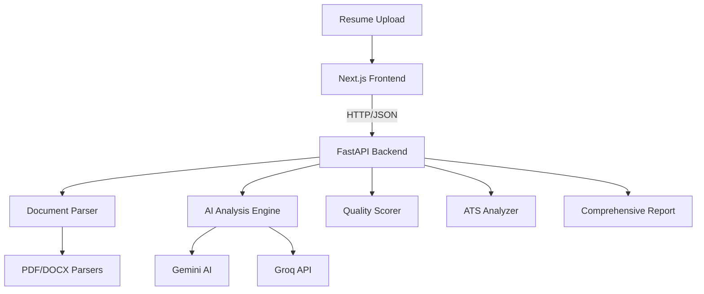

# 🚀 Resume Analyzer - AI-Powered Resume Analysis Platform

<div align="center">


**🎯 Comprehensive AI-Powered Resume Analysis with ATS Compatibility, Quality Scoring, and Professional Insights**

[🚀 Quick Start](#-quick-start) • [📖 Features](#-features) • [🏗️ Architecture](#%EF%B8%8F-architecture) • [📚 Documentation](#-documentation) • [🛠️ Development](#%EF%B8%8F-development)

</div>

---

## 🌟 Overview

**Resume Analyzer** is a comprehensive, full-stack application that leverages cutting-edge AI technology to provide detailed resume analysis, ATS compatibility scoring, and actionable professional insights. Built with modern web technologies and designed for both job seekers and hiring professionals.

### ✨ **Key Highlights**

- 🤖 **AI-Powered Analysis** - Google Gemini AI and Groq integration for intelligent insights
- 📊 **30+ Analysis Categories** - Comprehensive evaluation across multiple dimensions
- ⚡ **ATS Compatibility** - Ensure your resume passes Applicant Tracking Systems
- 🎯 **Quality Scoring** - 4-category scoring system (0-100 scale) with detailed feedback
- 🔍 **Skills Gap Analysis** - Identify missing skills and improvement opportunities
- 📱 **Modern UI/UX** - Responsive design with real-time analysis progress
- 🚀 **High Performance** - FastAPI backend with Next.js 15 + Turbopack frontend

---

## 🎯 Features

### 📄 **Document Processing**

- **Multi-format Support**: PDF, DOCX, DOC files
- **Advanced Parsing**: PyMuPDF for high-performance text extraction
- **Section Detection**: Intelligent identification of resume sections
- **Metadata Extraction**: Contact info, education, experience, skills

### 🤖 **AI-Powered Analysis**

- **Gemini AI Integration**: Advanced content analysis and insights
- **Groq API**: Fast language model inference
- **Natural Language Processing**: Content quality assessment
- **Intelligent Recommendations**: Personalized improvement suggestions

### 📊 **Comprehensive Scoring**

```
🎯 Content Completeness (25%)     ⭐ Professional Presentation (25%)
🛠️ Skills Relevance (25%)        💼 Experience Quality (25%)
```

### 🔍 **ATS Compatibility**

- **Keyword Optimization**: Industry-specific keyword analysis
- **Format Compatibility**: ATS-friendly structure validation
- **Parsing Quality**: Machine-readability assessment
- **Compliance Scoring**: Industry standards alignment

### 💡 **Professional Insights**

- **Industry Analysis**: Role-specific recommendations
- **Career Progression**: Experience timeline evaluation
- **Skills Matching**: Job requirement alignment
- **Competitive Analysis**: Market positioning insights

---

## 🏗️ Architecture

### **Full-Stack Modern Architecture**



### **🎨 Frontend Stack**

- **Framework**: Next.js 15.5.2 with React 19
- **Language**: TypeScript 5 for type safety
- **Styling**: Tailwind CSS 4 with responsive design
- **Build Tool**: Turbopack for ultra-fast development
- **State Management**: React Hooks with local state

### **🐍 Backend Stack**

- **Framework**: FastAPI for high-performance async API
- **Language**: Python 3.8+ with modern features
- **AI Integration**: Google Gemini AI + Groq APIs
- **Document Processing**: PyMuPDF, python-docx, PyPDF2
- **Analysis Engine**: Custom ML models and NLP processing

---

## 📚 Documentation

### **📋 Complete Documentation Suite**

| Document               | Description                                   | Link                                                   |
| ---------------------- | --------------------------------------------- | ------------------------------------------------------ |
| 📱 **Frontend README** | Next.js/React architecture, components, UI/UX | [`docs/FRONTEND_README.md`](./docs/FRONTEND_README.md) |
| 🐍 **Backend README**  | FastAPI/Python modules, AI integration, APIs  | [`docs/BACKEND_README.md`](./docs/BACKEND_README.md)   |

### **🎯 Quick Reference**

- **📱 Frontend**: Next.js 15 + React 19 + TypeScript + Tailwind CSS
- **🐍 Backend**: FastAPI + Python + AI APIs (Gemini, Groq)
- **📊 Analysis**: 30+ categories with 4-tier quality scoring
- **🤖 AI Features**: Content analysis, recommendations, insights
- **⚡ Performance**: Turbopack + async FastAPI + optimized parsing

---

## 🚀 Quick Start

### **Prerequisites**

```bash
Node.js 20+
Python 3.8+
Git
```

### **1. Clone Repository**

```bash
git clone https://github.com/raai2005/Resume-Analyzer.git
cd Resume-Analyzer
```

### **2. Frontend Setup**

```bash
# Install dependencies
npm install

# Start development server
npm run dev
```

### **3. Backend Setup**

```bash
# Install Python dependencies
pip install -r requirements.txt

# Backend Setup
cd backend
pip install -r ../requirements.txt

# Start FastAPI server
python main_server.py
```

### **4. Access Application**

```bash
Frontend: http://localhost:3000
Backend API: http://localhost:8000
API Docs: http://localhost:8000/docs
```

### **5. Environment Configuration**

```bash
# Create .env file
GOOGLE_API_KEY=your_gemini_api_key
GROQ_API_KEY=your_groq_api_key
CORS_ORIGINS=http://localhost:3000
```

---

## 🛠️ Development

### **📦 Project Structure**

```
Resume-Analyzer/
├── 📱 Frontend (Next.js)
│   ├── src/app/              # Next.js app router
│   ├── src/components/       # React components
│   └── public/              # Static assets
├── 🐍 Backend (Python)
│   ├── main_server.py       # FastAPI server entry point
│   ├── api/                 # API endpoints
│   ├── parsers/            # Document processing modules
│   ├── analyzers/          # Analysis engines
│   └── ai_services/        # AI integration services
├── 📚 Documentation
│   ├── FRONTEND_README.md  # Frontend documentation
│   └── BACKEND_README.md   # Backend documentation
└── ⚙️ Configuration
    ├── requirements.txt    # Python dependencies
    ├── package.json       # Node.js dependencies
    └── eslint.config.mjs  # Code quality rules
```

### **🧪 Development Commands**

```bash
# Frontend Development
npm run dev          # Start dev server
npm run build        # Production build
npm run lint         # Code linting

# Backend Development
cd backend
python main_server.py    # Start FastAPI
pip install -r ../requirements.txt  # Install deps

# Testing
npm run test         # Frontend tests
python -m pytest    # Backend tests
```

### **🔧 Code Quality**

- **ESLint**: Automated code quality checks
- **TypeScript**: Type safety for frontend
- **Python Type Hints**: Backend type safety
- **Prettier**: Code formatting standards

---

## 📊 Analysis Capabilities

### **🎯 Comprehensive Analysis Dashboard**

<div align="center">

| Category                    | Features                                | AI Enhancement            |
| --------------------------- | --------------------------------------- | ------------------------- |
| 📄 **Content Analysis**     | Section detection, completeness scoring | ✅ Gemini AI insights     |
| 🤖 **ATS Compatibility**    | Keyword optimization, format validation | ✅ Industry standards     |
| ⭐ **Quality Scoring**      | 4-category assessment (0-100 scale)     | ✅ ML-powered evaluation  |
| 🛠️ **Skills Analysis**      | Gap identification, relevance scoring   | ✅ Market trend analysis  |
| 💼 **Experience Review**    | Timeline analysis, role progression     | ✅ Career path insights   |
| 📚 **Education Assessment** | Qualification validation, relevance     | ✅ Industry alignment     |
| 💡 **Recommendations**      | Prioritized improvement suggestions     | ✅ Personalized guidance  |
| 🎯 **Job Matching**         | Role compatibility, skill alignment     | ✅ Context-aware analysis |

</div>

### **🏆 Advanced Features**

- **Real-time Analysis**: Live progress updates during processing
- **Interactive Results**: Expandable sections with detailed insights
- **Export Capabilities**: Downloadable analysis reports
- **Job Context**: Enhanced analysis with job description input
- **Multi-format Support**: PDF, DOCX, DOC file compatibility

---

## 🚀 Deployment

### **🌐 Production Deployment**

```bash
# Frontend (Vercel/Netlify)
npm run build
npm run start

# Backend (Docker/Cloud)
uvicorn fastapi_server:app --host 0.0.0.0 --port 8000 --workers 4

# Environment Variables
GOOGLE_API_KEY=production_key
GROQ_API_KEY=production_key
CORS_ORIGINS=https://yourdomain.com
```

### **🐳 Docker Support**

```dockerfile
# Frontend Dockerfile
FROM node:20-alpine
COPY . .
RUN npm install && npm run build
EXPOSE 3000
CMD ["npm", "start"]

# Backend Dockerfile
FROM python:3.11-slim
COPY . .
RUN pip install -r requirements.txt
EXPOSE 8000
CMD ["uvicorn", "fastapi_server:app", "--host", "0.0.0.0"]
```

---

## 🤝 Contributing

### **🛠️ Development Workflow**

1. **Fork** the repository
2. **Create** feature branch (`git checkout -b feature/amazing-feature`)
3. **Commit** changes (`git commit -m 'Add amazing feature'`)
4. **Push** to branch (`git push origin feature/amazing-feature`)
5. **Open** Pull Request

### **📋 Contribution Guidelines**

- Follow existing code style and conventions
- Add tests for new features
- Update documentation for API changes
- Ensure all tests pass before submitting PR

---

## 📄 License

This project is licensed under the **MIT License** - see the [LICENSE](LICENSE) file for details.

---

## 🙋‍♂️ Support & Contact

<div align="center">

**Built with ❤️ by [raai2005](https://github.com/raai2005)**

[](https://github.com/raai2005/Resume-Analyzer/issues)
[](https://github.com/raai2005/Resume-Analyzer/stargazers)
[](https://github.com/raai2005/Resume-Analyzer/network)

</div>

---

<div align="center">

### 🌟 **Star this repository if you found it helpful!** 🌟

</div>
   pip install -r requirements.txt
   ```

2. **Install Node.js dependencies:**

   ```bash
   npm install
   ```

3. **Set up environment variables:**
   Create a `.env` file in the root directory:
   ```
   GEMINI_API_KEY=your_gemini_api_key_here
   CORS_ORIGINS=http://localhost:3000
   ```

## Running the Application

1. **Start the Python backend:**

   ```bash
   python fastapi_server.py
   ```

   The API server will run on `http://localhost:8000`

2. **Start the Next.js frontend:**
   ```bash
   npm run dev
   ```
   The web application will be available at `http://localhost:3000`

## Usage

1. Open the application in your browser
2. Upload a resume (PDF or DOCX format)
3. Optionally provide job details for targeted analysis
4. View comprehensive analysis results including:
   - Contact information extraction
   - Skills analysis and matching
   - ATS compatibility score
   - Quality assessment
   - AI-powered insights and recommendations

## API Documentation

The API provides a comprehensive analysis endpoint at `/analyze-resume` with detailed response structure documented in `API_DOCUMENTATION.md`.

## Build for Production

```bash
npm run build
npm start
```

For the Python backend, use a production WSGI server like Gunicorn:

```bash
pip install gunicorn
gunicorn fastapi_server:app -w 4 -k uvicorn.workers.UvicornWorker
```
